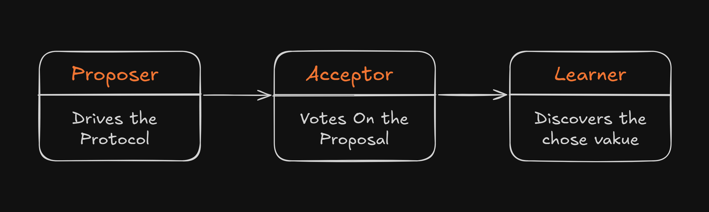

# Paxos Consensus Algorithm

## What is Paxos?

Paxos is a family of protocols for solving **consensus** in a network of
unreliable processors. Consensus means getting multiple computers to agree
on a single value, even when some computers fail or messages get lost.

### The Problem Paxos Solves

Imagine 5 servers that need to agree on "who is the leader" or "what is the
next database transaction". Without a consensus protocol:
- Server A might think X is the answer
- Server B might think Y is the answer
- **Disaster**: The system is inconsistent

Paxos guarantees that **all non-faulty servers will eventually agree on the
same value**, and once they agree, the decision is permanent.


## Core Concepts

### Safety vs Liveness

**Safety** (Things that must NEVER happen):
- Two different values are both "chosen"
- A value is chosen without being proposed

**Liveness** (Things that must EVENTUALLY happen):
- Some proposed value is eventually chosen
- All learners eventually learn the chosen value

Paxos **guarantees safety** under all conditions, but only guarantees
liveness when there's a clear leader (no competing proposers).

### The Three Roles



**Proposer**: Suggests values, coordinates the protocol
**Acceptor**: Votes on proposals, provides durability
**Learner**: Observes votes, detects when consensus is reached

In practice, each server plays ALL THREE roles simultaneously.

### The Two Phases

**Phase 1: PREPARE**
```
Proposer → Acceptors: "I want to propose with number N"
Acceptors → Proposer: "OK, and here's what I've accepted before"
```

**Phase 2: ACCEPT**
```
Proposer → Acceptors: "Please accept value V with number N"
Acceptors → Proposer: "Accepted!" (if N is still highest)
```

A value is **chosen** when a majority of acceptors have accepted it.


## Project Structure

```
quorum/
├── cmd/
│   └── demo/
│       └── main.go              # Demo runner
├── internal/
│   ├── paxos/
│   │   ├── proposal.go          # Proposal number definition
│   │   ├── message.go           # All message types
│   │   ├── acceptor.go          # Acceptor role implementation
│   │   ├── proposer.go          # Proposer role implementation
│   │   └── learner.go           # Learner role implementation
│   ├── node/
│   │   └── node.go              # Combines all roles into one node
│   ├── storage/
│   │   ├── storage.go           # Storage interface
│   │   └── memory.go            # In-memory storage
│   └── transport/
│       ├── transport.go         # Transport interface
│       └── memory.go            # In-memory transport
├── go.mod
└── README.md
```


## Implementation Order

Follow this exact order. Each step builds on the previous:

### Step 1: Foundation (Start Here)
1. `internal/paxos/proposal.go` - Understand proposal numbers
2. `internal/paxos/message.go` - Define all message types

### Step 2: The Safety Guardian
3. `internal/paxos/acceptor.go` - Implement acceptor logic
   - This is where safety properties are enforced!

### Step 3: The Driver
4. `internal/paxos/proposer.go` - Implement proposer logic
   - Coordinates Phase 1 and Phase 2

### Step 4: The Observer
5. `internal/paxos/learner.go` - Implement learner logic
   - Detects when values are chosen

### Step 5: Abstractions
6. `internal/storage/storage.go` - Storage interface
7. `internal/storage/memory.go` - In-memory implementation
8. `internal/transport/transport.go` - Transport interface
9. `internal/transport/memory.go` - In-memory implementation

### Step 6: Integration
10. `internal/node/node.go` - Wire everything together
11. `cmd/demo/main.go` - Run a demo


## Key Invariants to Remember

1. **Proposal numbers are globally unique** - If two proposers use the same
   number, safety breaks.

2. **Acceptors never go back on promises** - Once an acceptor promises not
   to accept proposals below N, it MUST reject them.

3. **Majority quorums always overlap** - Any two majorities share at least
   one member. This is why we need a majority, not just "any group".

4. **Chosen values are immutable** - Once a value is chosen, no other value
   can ever be chosen for this consensus instance.


## From Single-Decree to Multi-Paxos

This project starts with **Single-Decree Paxos** (agreeing on ONE value).
The structure is designed to extend to **Multi-Paxos** (agreeing on a
SEQUENCE of values, like a replicated log).

Key extension points:
- Add "slot" or "index" to messages
- Run multiple Paxos instances in parallel
- Optimize by reusing Phase 1 across slots (leader lease)


## Resources

1. [Paxos Made Simple](https://lamport.azurewebsites.net/pubs/paxos-simple.pdf)
2. [Raft paper](https://raft.github.io/raft.pdf) - A more understandable alternative that's similar


## Running the Demo

```bash
# After implementing all files:
go run ./cmd/demo
```
